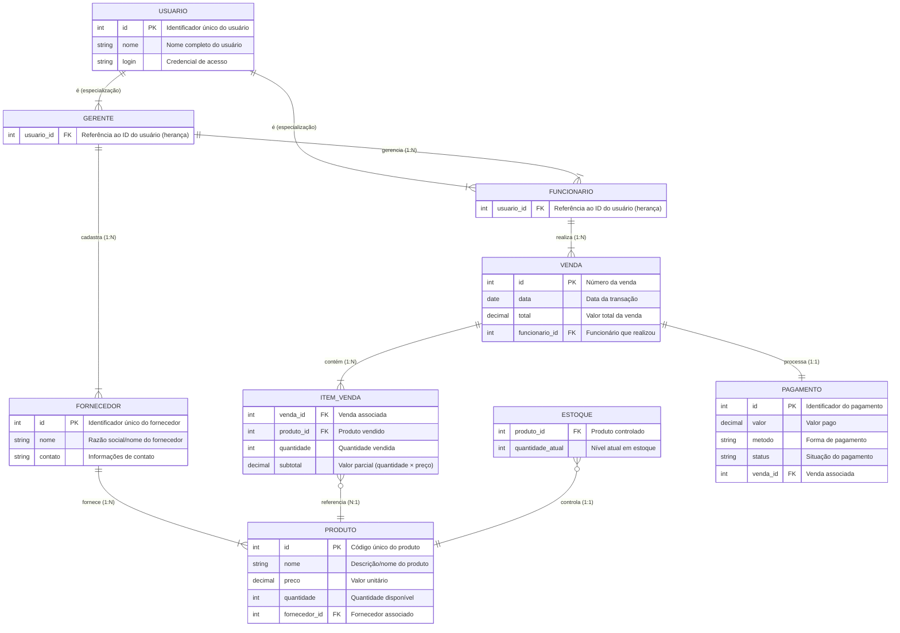

- [Esquema relacional](create_script.sql)
- [Dados iniciais](inserts_script.sql)

### Modelo de Entidade Relacionamento ER

```mermaid
erDiagram
    USUARIO {
        int id PK "Identificador único do usuário"
        string nome "Nome completo do usuário"
        string login "Credencial de acesso"
    }

    GERENTE {
        int usuario_id FK "Referência ao ID do usuário (herança)"
    }

    FUNCIONARIO {
        int usuario_id FK "Referência ao ID do usuário (herança)"
    }

    FORNECEDOR {
        int id PK "Identificador único do fornecedor"
        string nome "Razão social/nome do fornecedor"
        string contato "Informações de contato"
    }

    PRODUTO {
        int id PK "Código único do produto"
        string nome "Descrição/nome do produto"
        decimal preco "Valor unitário"
        int quantidade "Quantidade disponível"
        int fornecedor_id FK "Fornecedor associado"
    }

    ESTOQUE {
        int produto_id FK "Produto controlado"
        int quantidade_atual "Nível atual em estoque"
    }

    VENDA {
        int id PK "Número da venda"
        date data "Data da transação"
        decimal total "Valor total da venda"
        int funcionario_id FK "Funcionário que realizou"
    }

    ITEM_VENDA {
        int venda_id FK "Venda associada"
        int produto_id FK "Produto vendido"
        int quantidade "Quantidade vendida"
        decimal subtotal "Valor parcial (quantidade × preço)"
    }

    PAGAMENTO {
        int id PK "Identificador do pagamento"
        decimal valor "Valor pago"
        string metodo "Forma de pagamento"
        string status "Situação do pagamento"
        int venda_id FK "Venda associada"
    }

    USUARIO ||--|{ GERENTE : "é (especialização)"
    USUARIO ||--|{ FUNCIONARIO : "é (especialização)"
    GERENTE ||--|{ FUNCIONARIO : "gerencia (1:N)"
    GERENTE ||--|{ FORNECEDOR : "cadastra (1:N)"
    FORNECEDOR ||--|{ PRODUTO : "fornece (1:N)"
    FUNCIONARIO ||--|{ VENDA : "realiza (1:N)"
    VENDA ||--|{ ITEM_VENDA : "contém (1:N)"
    ITEM_VENDA }o--|| PRODUTO : "referencia (N:1)"
    VENDA ||--|| PAGAMENTO : "processa (1:1)"
    ESTOQUE }o--|| PRODUTO : "controla (1:1)"
```
